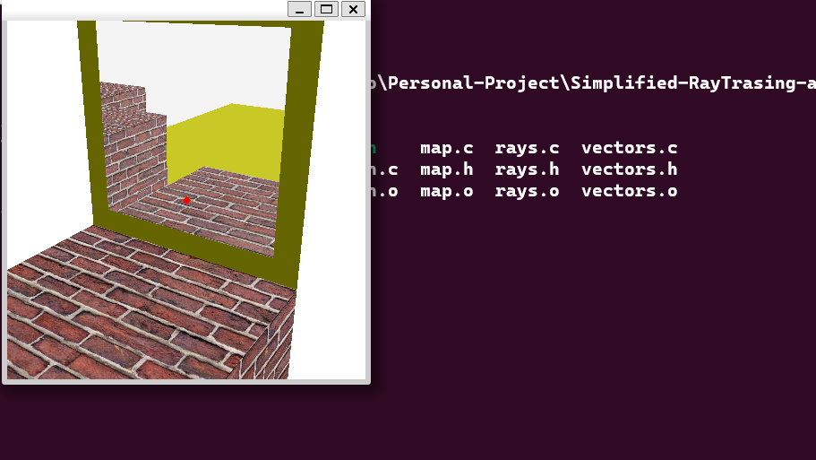

# Simplified-RayTrasing-algorithm-in-C-
The programing is developed by Owen Li, Haotian Qi, Bolei Cheng,  Arun Hussain together for the extension part of C group project
---
### Little Demo
* under ubuntu operation system
``` shell
sudo apt-get install libsdl2-2.0-0
./run main
```
The GUI interface should appear in front of the console.

### Control 
 * WASD for movement
 * ↑↓←→ for changing angle of view 

### ReCompile
``` shell
rm -rf CMakeFiles
rm CMakeCache.txt
cmake .
make
```
### Key feature
 * support collision box
 * support reflection
 * support texture
  
